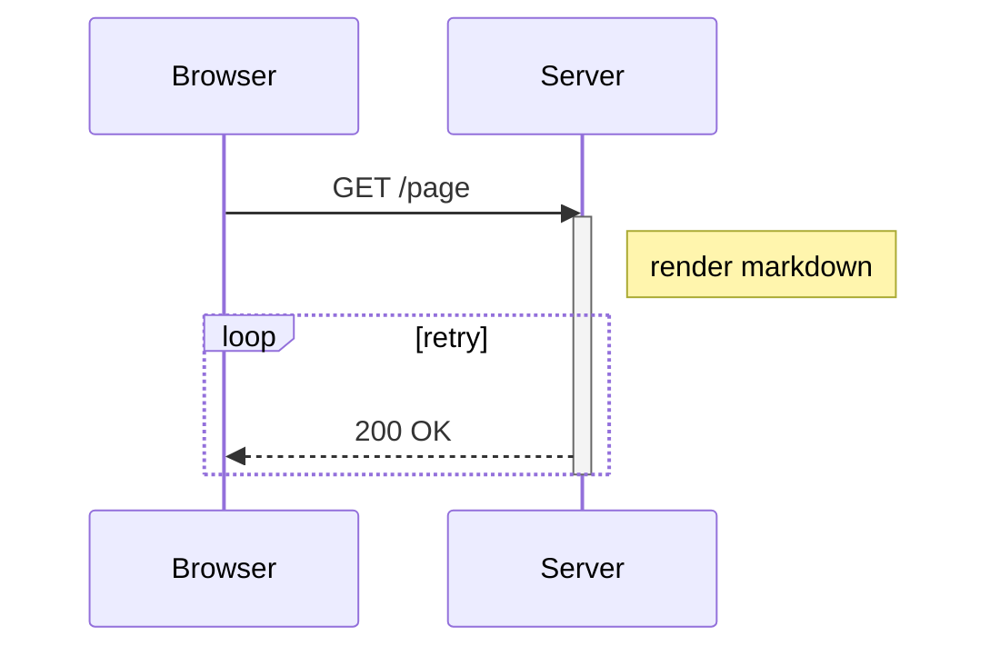

```mermaid
sequenceDiagram
    participant B as Browser
    participant S as Server
    B->>S: GET /page
    activate S
    Note right of S: render markdown
    loop retry
        S-->>B: 200 OK
    end
    deactivate S
```
